# 🚀 MarketingAI Studio

> **Production-grade, AI-native, multi-agent marketing platform** powered by the Google Ecosystem.

[](https://deepmind.google/technologies/gemini/)
[](https://google.github.io/adk-docs/)
[](https://cloud.google.com/)
[](https://www.python.org/)
[](https://fastapi.tiangolo.com/)
[](https://reactjs.org/)
[](https://www.typescriptlang.org/)
[](https://vitejs.dev/)
[](https://tailwindcss.com/)
[](https://xyflow.com/)
[](https://zustand-demo.pmnd.rs/)
[](https://www.mongodb.com/)
[](https://docker.com)

---

## 🎥 YouTube Demo
[](https://youtu.be/hbCX38m3LAs?si=uAGkXZniQJG1iz7-)

---

## 🏗️ Technical Architecture

MarketingAI Studio is a high-performance, containerized ecosystem designed for advanced AI orchestration and visual creative workflows.

### 🏛️ High-Level Blueprint
*Overview of the core system flow and component relationships.*

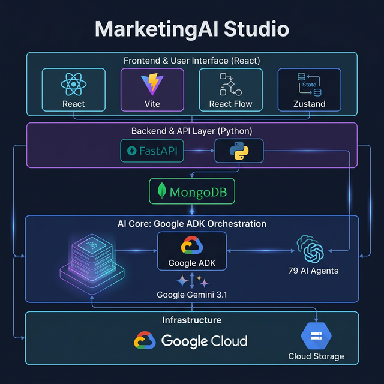

### 🔬 In-Depth System Flow
*Detailed breakdown featuring the multi-model brain and production infrastructure.*

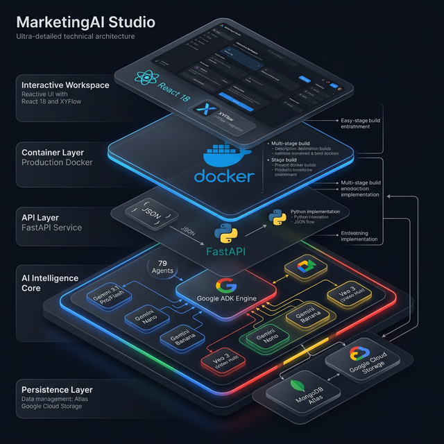

### 🧠 The Multi-Model Brain
The system leverages the **Google ADK** (Agent Development Kit) to orchestrate a sophisticated multi-model brain:
- **Strategic Reasoning**: **Gemini 3.1 Pro** for complex campaign planning.
- **Creative Generation**: **Gemini 3.1 Flash** for high-speed content delivery.
- **Edge Intelligence**: **Gemini Nano** and **Gemini Banana** for specialized logic.
- **Visual Synthesis**: **Google Veo 3** — The state-of-the-art engine for high-fidelity video.

### 🐋 Deployment & Stack
- **Runtime**: Unified **Docker** multi-stage production build.
- **Backend**: High-concurrency **FastAPI** (Python 3.12).
- **Frontend**: **React 18** + **XYFlow** (Interactive Canvas).

---
## 🎬 Platform Interface

Explore the high-fidelity MarketingAI Studio experience.

| 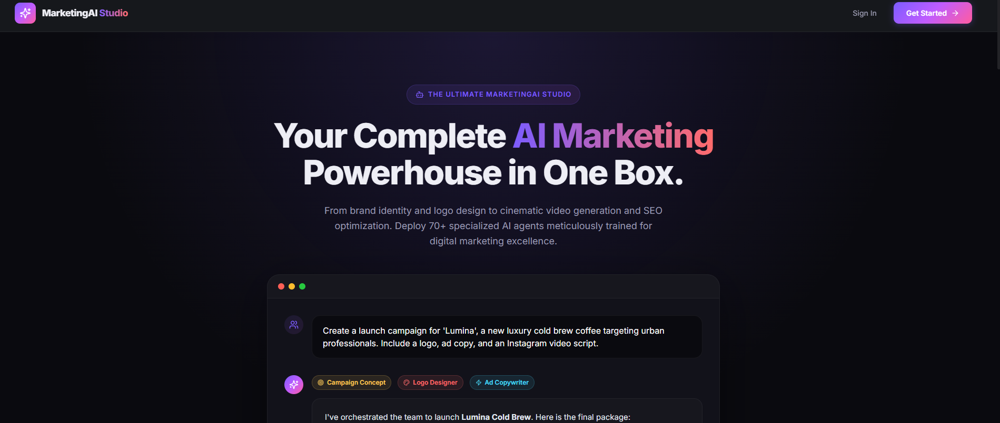 |
| :---: |
| **Product Landing Page (1)** |

| 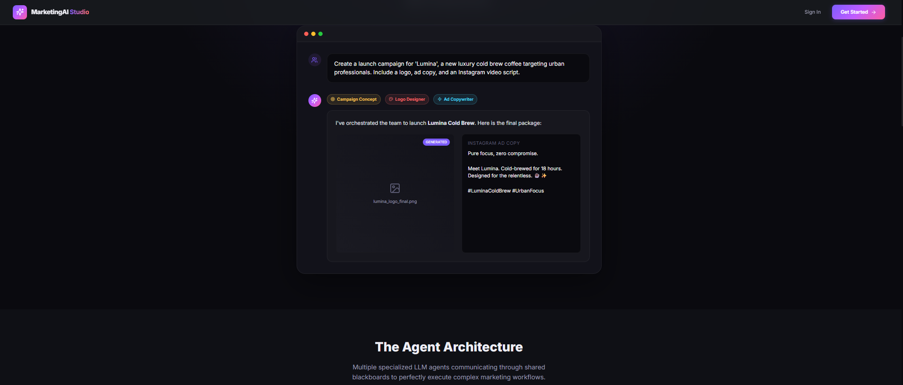 |
| :---: |
| **Product Landing Page (1a)** |

| 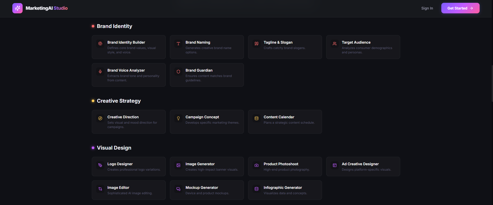 |
| :---: |
| **Product Landing Page (1b)** |

| 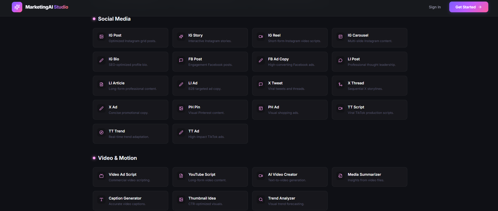 |
| :---: |
| **Product Landing Page (1c)** |

| 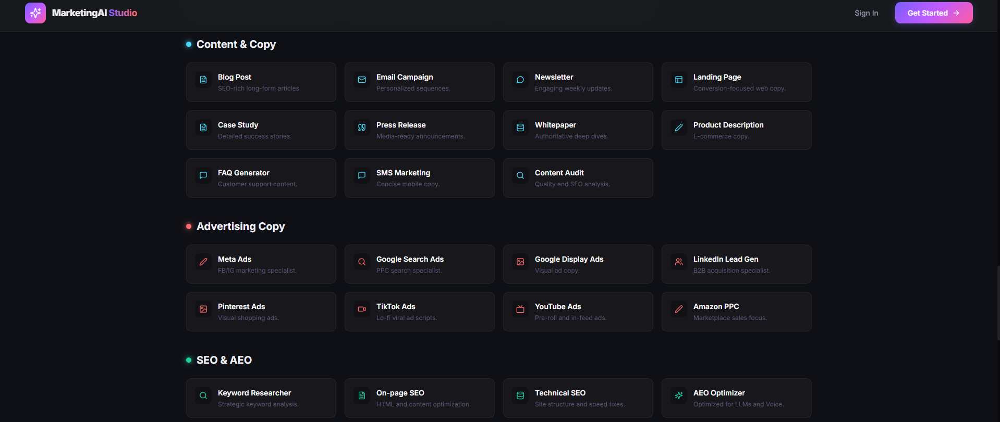 |
| :---: |
| **Product Landing Page (1d)** |

| 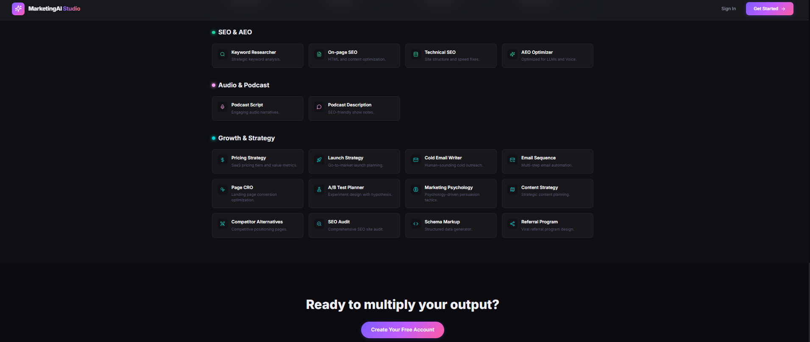 |
| :---: |
| **Product Landing Page (1e)** |

| 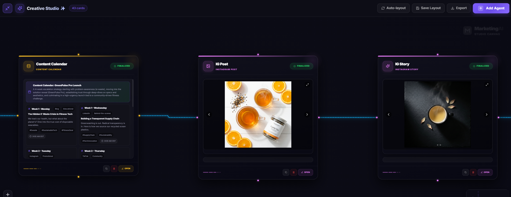 |
| :---: |
| **Infinite Canvas Workspace** |

| 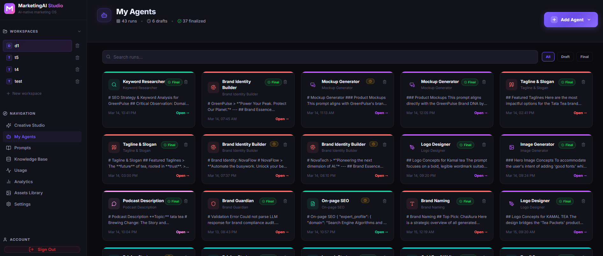 |
| :---: |
| **My Agents Manager** |

| 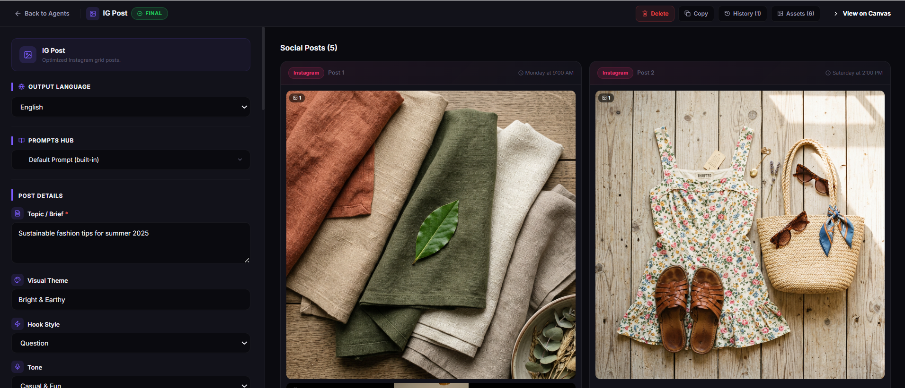 |
| :---: |
| **Instagram Post Agent (Example 1)** |

| 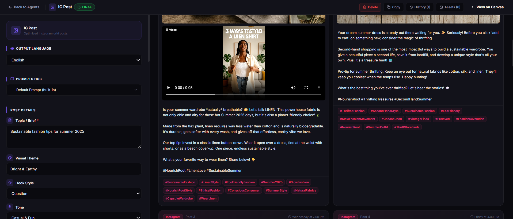 |
| :---: |
| **Instagram Post Agent (Example 2)** |

| 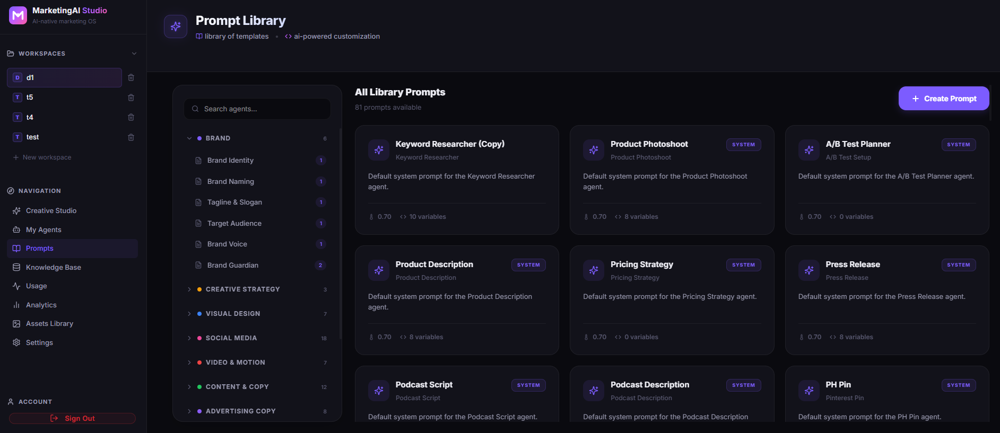 |
| :---: |
| **Prompt Library** |

| 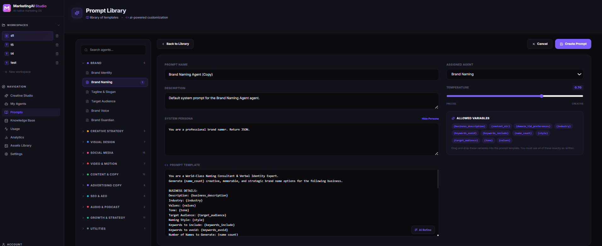 |
| :---: |
| **Advanced Prompt Editor** |

| 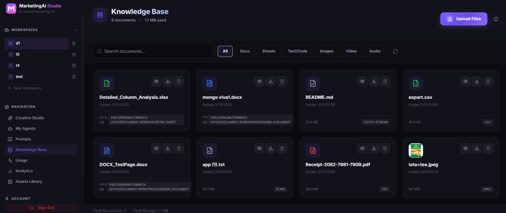 |
| :---: |
| **Workspace Knowledge Base** |

| 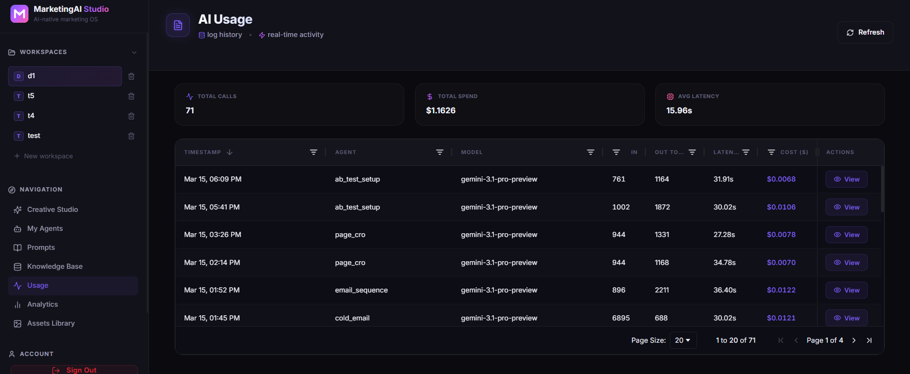 |
| :---: |
| **Usage Tracking (Overview)** |

| 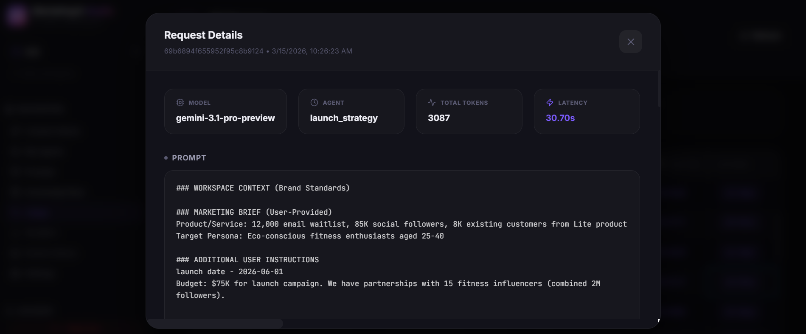 |
| :---: |
| **Detailed Usage Metrics** |

| 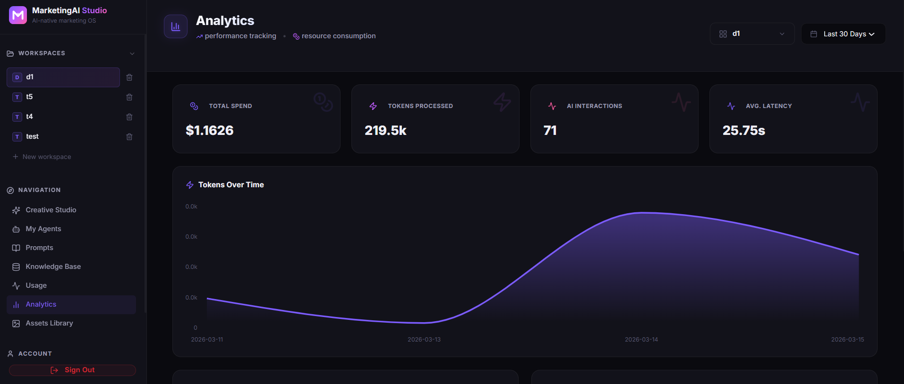 |
| :---: |
| **Performance Analytics (Chart)** |

| 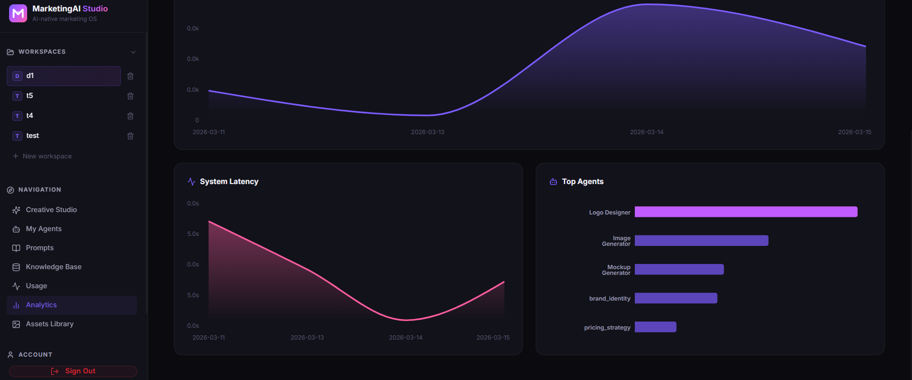 |
| :---: |
| **Performance Analytics (Grid)** |

| 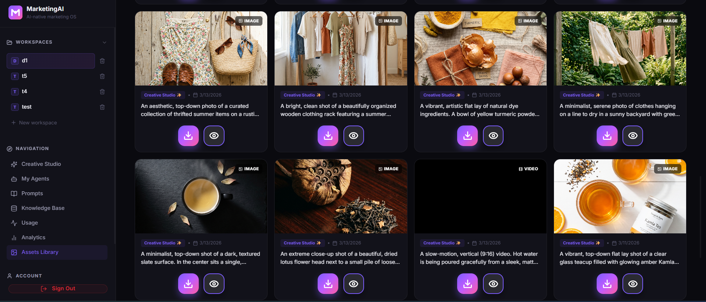 |
| :---: |
| **Asset Library** |

|  |
| :---: |
| **Ad Creative Designer** |

|  |
| :---: |
| **Brand Guardian** |

|  |
| :---: |
| **Brand Identity Builder** |

|  |
| :---: |
| **Brand Naming** |

|  |
| :---: |
| **Brand Voice Analyzer** |

|  |
| :---: |
| **Campaign Concept** |

|  |
| :---: |
| **Content Calendar** |

|  |
| :---: |
| **Creative Direction** |

|  |
| :---: |
| **Email Sequence** |

|  |
| :---: |
| **Facebook Post** |

|  |
| :---: |
| **Instagram Carousel** |

|  |
| :---: |
| **Instagram Post** |

|  |
| :---: |
| **Instagram Reel** |

|  |
| :---: |
| **Instagram Story** |

|  |
| :---: |
| **Image Editor** |

|  |
| :---: |
| **Image Generator** |

|  |
| :---: |
| **Infographic Generator** |

|  |
| :---: |
| **Keyword Researcher** |

|  |
| :---: |
| **Launch Strategy** |

|  |
| :---: |
| **Logo Designer** |

|  |
| :---: |
| **Mockup Generator** |

|  |
| :---: |
| **On-Page SEO** |

|  |
| :---: |
| **Page Conversion Rate Optimization** |

|  |
| :---: |
| **Pricing Strategy** |

|  |
| :---: |
| **Product Photoshoot** |

|  |
| :---: |
| **TikTok Script** |

|  |
| :---: |
| **Tagline & Slogan** |

|  |
| :---: |
| **Target Audience** |

|  |
| :---: |
| **Technical SEO** |

---

## 🎯 What is MarketingAI Studio?

MarketingAI Studio is a **form-driven, agent-orchestrated** marketing laboratory. Built with **Google ADK**, it leverages **79 specialized AI agents** to transform your strategy into high-fidelity assets.

### ✨ Key Features

| Feature | Description |
|---------|-------------|
| **79 Specialized Agents** | Ten distinct categories of experts ranging from SEO to Video production. |
| **Form-Driven Precision** | Structured configurations for zero-hallucination, brand-aligned outputs. |
| **Interactive Canvas** | Powered by **React Flow (XYFlow)** for visual marketing orchestration. |
| **Asset Library** | Centralized gallery for quick discovery, preview, and high-speed downloads of all AI-generated assets. |
| **Usage & Analytics** | Real-time tracking of agent activity and campaign performance metrics. |
| **3.1 Multi-Model Power** | Leveraging **Gemini 3.1 Pro**, **3.1 Flash**, **Gemini Nano**, **Gemini Banana**, and **Veo 3**. |
| **Google Cloud Storage** | Persistent, secure storage for all generated logos, banners, and videos. |
| **Infinite Workspace** | Map out entire campaigns on a spatial, node-based interface using **Google Ecosystem** tools. |

---

## 🧠 The 79 Specialized Agents

Our agents are categorized into expert departments, each powered by fine-tuned prompts and the **Google ADK** toolset.

### 🏷️ Brand Identity (6)
- **Brand Identity Builder**: Defines core values, visual style, and voice.
- **Brand Naming**: Generates creative brand name options.
- **Tagline & Slogan**: Crafts catchy brand slogans.
- **Target Audience**: Analyzes consumer demographics and personas.
- **Brand Voice Analyzer**: Extracts brand tone and personality from content.
- **Brand Guardian**: Ensures content matches brand guidelines.

### 🎨 Creative Strategy (3)
- **Creative Direction**: Sets visual and mood direction for campaigns.
- **Campaign Concept**: Develops specific marketing themes.
- **Content Calendar**: Plans a strategic content schedule.

### 🖼️ Visual Design (7)
- **Logo Designer**: Creates professional logo variations.
- **Image Generator**: Creates high-impact banner visuals.
- **Product Photoshoot**: High-end product photography.
- **Ad Creative Designer**: Designs platform-specific visuals.
- **Image Editor**: Sophisticated AI image editing.
- **Mockup Generator**: Device and product mockups.
- **Infographic Generator**: Visualizes data and concepts.

### 📱 Social Media (18)
- **Instagram**: Optimized Post, Story, Reel scripts, Carousel, and Bio.
- **Facebook**: Engagement posts and high-converting ad copy.
- **LinkedIn**: Professional leadership articles, posts, and ads.
- **X (Twitter)**: Viral tweets, threads, and ad copy.
- **Pinterest**: Visual Pins and Shopping Ads.
- **TikTok**: Viral production scripts, Trend adapters, and Ads.

### 🎬 Video & Motion (7)
- **Video Ad Script**: Commercial video scripting.
- **YouTube Script**: Long-form video content.
- **AI Video Creator**: Text-to-video generation via **Google Veo 3**.
- **Media Summarizer**: Insights from video files.
- **Caption Generator**: Accurate video captions.
- **Thumbnail Idea**: CTR-optimized visuals.
- **Trend Analyzer**: Visual trend forecasting.

### 📝 Content & Copy (11)
- **Blog Post**: SEO-rich long-form articles.
- **Email Campaign**: Personalized high-conversion sequences.
- **Newsletter**: Engaging community updates.
- **Landing Page**: Sales-focused web copy.
- **Case Study**: Detailed success stories.
- **Press Release**: Media-ready announcements.
- **Whitepaper**: Authoritative industry deep dives.
- **Product Description**: E-commerce catalog optimization.
- **FAQ Generator**: Customer support and SEO content.
- **SMS Marketing**: Punchy mobile-first copy.
- **Content Audit**: Quality and performance analysis.

### 💰 Advertising Copy (8)
- **Network Specialists**: Meta, Google Search, Google Display, LinkedIn, Pinterest, TikTok, YouTube, and Amazon PPC.

### 🔍 SEO & AEO (4)
- **Keyword Researcher**: Strategic keyword analysis.
- **On-page SEO**: Content structural optimization.
- **Technical SEO**: Site architecture and speed fixes.
- **AEO Optimizer**: Optimized for LLMs and Voice search.

### 🎙️ Audio & Podcast (2)
- **Podcast Script**: Engaging narrative-driven audio.
- **Podcast Description**: SEO-friendly show notes.

### 🚀 Growth & Strategy (12)
- **SaaS Focus**: Pricing Strategy, Launch Strategy, and Referral Programs.
- **Growth Tools**: Cold Email Writing, Email Sequences, and Page CRO.
- **Experiments**: A/B Test Planning and Marketing Psychology.
- **Analysis**: Content Strategy, Competitor Alternatives, and SEO Audits.

---

## 🚀 Deployment (Unified Docker)

Build and run the entire platform with a single command from the root.

### 1. Configure Environment
Create a `backend/.env` file based on the following example:

```env
# Server Configuration
PORT=8002
ENVIRONMENT=production
SECRET_KEY=your-secure-secret-key-here

# MongoDB Configuration
MONGODB_URI=mongodb+srv://<username>:<password>@cluster.mongodb.net/
MONGODB_DB_NAME=marketing_ai_studio

# Google AI / Gemini API
GEMINI_API_KEY=your_gemini_api_key_here

# Google Cloud Storage
GCS_BUCKET_NAME=your_gcs_bucket_name
GCS_PROJECT_ID=your_gcs_project_id
GOOGLE_APPLICATION_CREDENTIALS=path/to/your/credentials.json

# Model Configuration (Next-Gen)
MODEL_TEXT=gemini-3.1-pro-preview
MODEL_IMAGE_GEN=gemini-3.1-flash-image-preview
MODEL_VIDEO_GEN=veo-3.1-fast-generate-preview
MODEL_EDGE=gemini-nano
MODEL_EXPERIMENT=gemini-banana
MODEL_VIDEO_PRO=veo-3
```

### 2. Build and Run
```bash
# Build the production image (Frontend + Backend)
docker build -t marketing-ai-studio .

# Run the container
docker run -p 8002:8002 --env-file backend/.env marketing-ai-studio
```

---

## 🛠️ Tech Stack

- **Intelligence**: Google Gemini 3.1 (Pro, Flash), **Gemini Nano**, **Gemini Banana**, **Veo 3**.
- **Framework**: **Google ADK** (Agent Development Kit).
- **Backend**: FastAPI (Python 3.12), Motor.
- **Frontend**: React 18, Vite, Zustand, React Flow.
- **Cloud**: Google Cloud Storage, Google Cloud Logging.

---

<p align="center">
  Made with ❤️ using the <strong>Google Ecosystem</strong>: <strong>Gemini 3.1</strong>, <strong>Antigravity</strong>, <strong>Google ADK</strong>, and <strong>Google Cloud</strong>.
</p>
